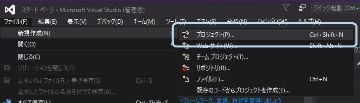
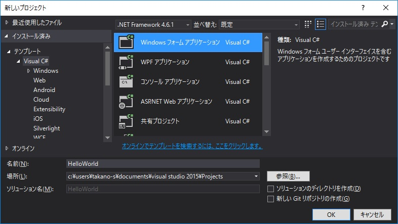
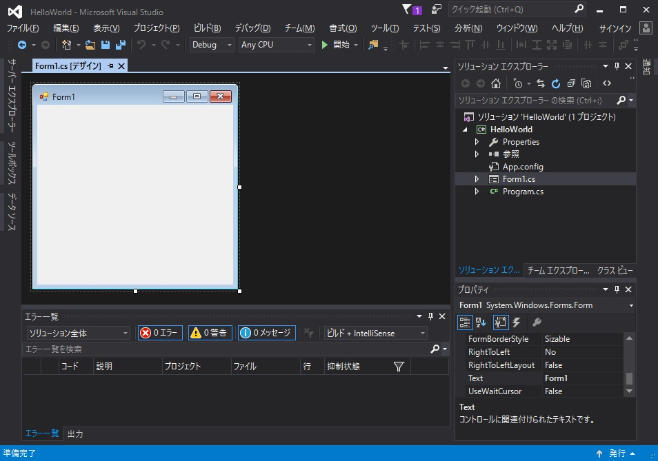
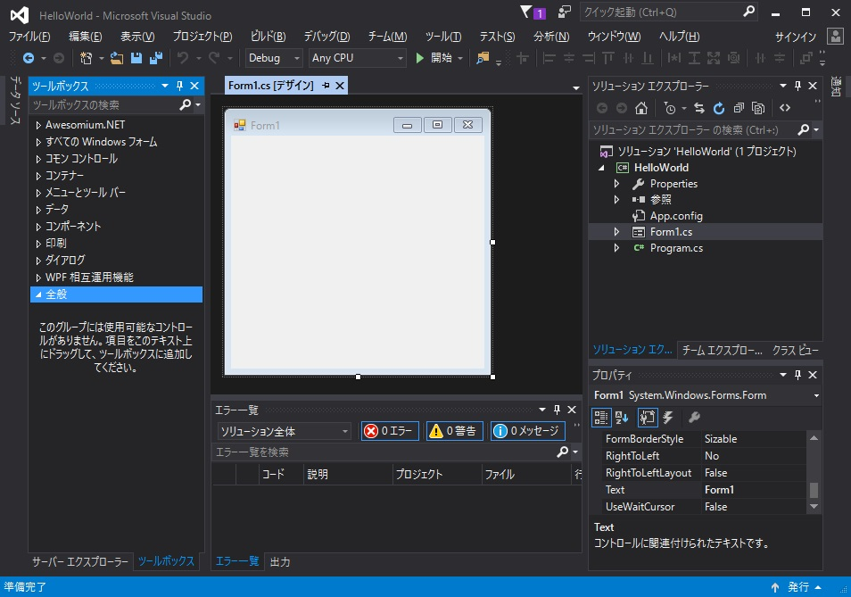
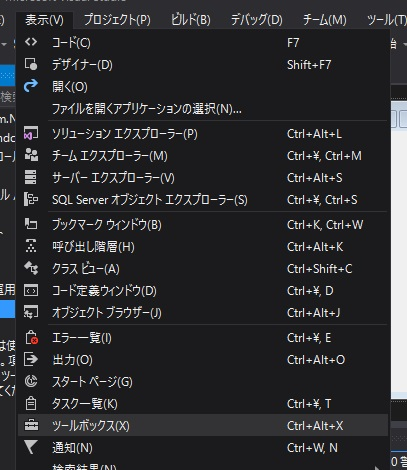
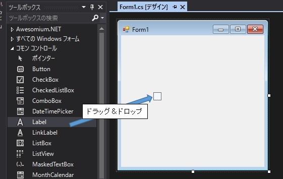
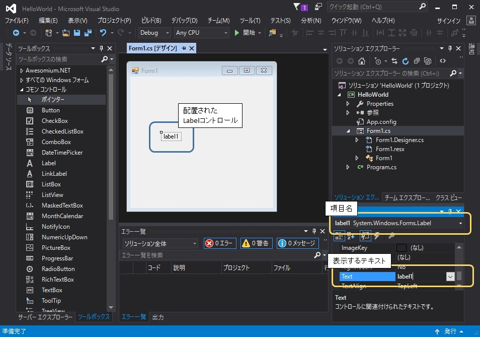
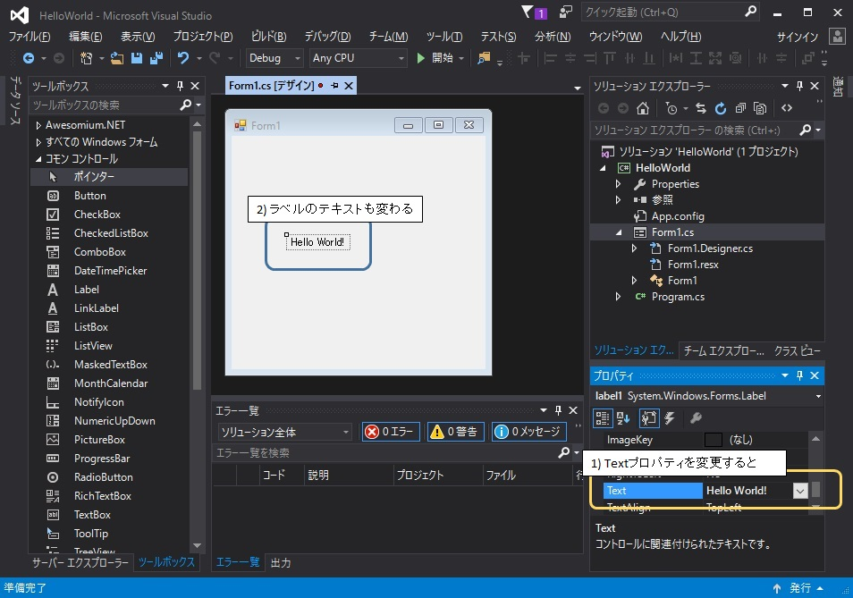
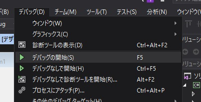
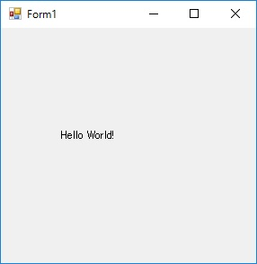

Hello World!
=====

[↑目次](..\README.md "目次")

Windows Formsを用いたGUIプログラミングの世界にようこそ！まずは最も簡単な「Hello World!」を表示するアプリケーションを作成しながら、Windows Formsアプリケーションの作り方を学んでいきましょう。

## Windows Formsとは？

はじめに「Windows Forms」とは何かというと、いわゆる「普通のWindowsのGUIアプリケーション」を作るためのプラットフォームです。その特徴は次のようなものです。

- マウスによる画面デザイン  
  テキストボックスやボタンなどの「コントロール」と呼ばれる「部品」を、マウスでドラッグ＆ドロップすることで配置し、実際の見た目を確認しながら画面をデザインできます。
- イベント・ドリブン  
  「画面が読み込まれた」、「ボタンが押された」、「テキストボックスの入力値が変更された」などのアクションをイベントと呼び、イベントに対する処理を記述してアプリケーションを作成します。

Windows Formsは.NET Frameworkのリリース時からあるプラットフォームですので、少し古臭いことは否めません。現在ではWPF（Windows Presentation Foundation）、UWP（Universal Windows Application）といった新たなプラットフォームもあります。

それでも、Windows Formsは今でも多く使われていますし、とっつきやすいのでGUIプログラミングの入門にはうってつけです。

## 初めてのGUIアプリケーション作成

何はともあれ、まずは画面に「Hello World!」を表示するだけの、簡単なGUIアプリケーションを作成してみましょう。

### プロジェクト作成

メニューから「新規作成」→「プロジェクト」を選択するなどして、「新しいプロジェクト」ダイアログを表示します（図1-1）。

図1-1 プロジェクトの新規作成

「新しいプロジェクト」ダイアログが表示されたら、「Visual C#」→「Windows フォーム アプリケーション」を選択してプロジェクトを作成します（図1-2）。名前等は次のように設定します。

- 名前 : HelloWorld
- 場所 : 任意
- ソリューションのディレクトリを作成 : チェックオフ
- 対象フレームワーク : .NET Framework 4.6.1

図1-2 HelloWorldプロジェクトの作成

プロジェクトが作成されると、`Form1.cs`ファイルの「フォーム デザイナ」が表示されます（図1-3）。Windows Formsでは、このフォームに各種の「コントロール」を配置して、画面をデザインしていくことになります。

図1-3 「フォーム デザイナ」の表示

### コントロールの配置

それでは、さっそく「コントロール」を使って画面に"Hello World!"を表示してみましょう。

まず最初に、VSの左側にある「ツールボックス」タブをクリックして、「ツールボックス」ウィンドウを表示します（図1-4）。もし「ツールボックス」タブがないときは、「表示」メニュー→「ツールボックス」を選択してください（図1-5）。また、「ツールボックス」に表示されているとおり、`Ctrl+Alt+X`のショートカットキーでも表示することができます。

表示した「ツールボックス」ウィンドウは、右上の「ピン」マークをクリックして、常に表示するようにしておきましょう。

図1-4 「ツールボックス」の表示

図1-5 「表示」メニュー→「ツールボックス」

次に、「ツールボックス」ウィンドウから、対象の「コントロール」を「フォーム デザイナ」上のフォームにドラッグ＆ドロップして配置します。ここでは、テキストを表示するための「Label（ラベル）」コントロールを使用します。「コモン コントロール」タブ→「Label」をフォーム上にドラッグ＆ドロップしてください（図1-6）。

図1-6 「Label（ラベル）」コントロールの配置

すると、フォーム上に"label1"と書かれた枠のついた項目が追加されます。これが、今配置したLabelコントロールです。

配置したコントロールにはそれぞれ独立した名前がつけられ、「プロパティ」ウィンドウの一番上のドロップダウンリストを見ると確認できます。既定では"コントロール名（小文字）+1からの連番"がつけられますので、今回は"label1"という項目名になっています（この名前はもちろん後から変更できます。）。

そして、項目に表示するテキストは、「プロパティ」ウィンドウの`Text`プロパティが該当します。既定では項目名と同じ内容が設定されます。

図1-7 配置されたLabelコントロール

### プロパティの変更

今度は"Hello World!"を表示するよう、配置したコントロールのプロパティを変更していきましょう。

まず、先ほど配置した`label1`コントロールをマウスでクリックし、図1-7のように選択された状態にします。次に「プロパティ」ウィンドウの`Text`プロパティを選択し、"label1"から"Hello World!"に変更して`Enter`キーを押します。すると、「フォーム デザイナ」での表示も"Hello World!"に変更されます（図1-8）。

図1-8 プロパティの変更

### アプリケーションの実行

これで今回のアプリケーションは完成しました。さっそく実行してみましょう。

実行するには、コンソールアプリケーションと同様に「デバッグ」メニュー→「デバッグの開始」を選択するか、「デバッグの開始」に書いてあるように、`F5`キーを押します（図1-9）。

図1-9 デバッグの開始

ビルドが行われた後、作成したアプリケーションが起動すると、「フォーム デザイナ」でデザインした通り、"Hello World!"が表示された画面が表示されます（図1-10）。

図1-10 アプリケーション実行結果

## Windows Formsアプリケーションの仕組み

さて、ここまで簡単なHello Worldアプリケーションの作成を通じて、Windows Formsアプリケーションの始め方を見てきました。しかし、いったいこのアプリケーションはどのような仕組みで動いているのでしょうか。

### フォーム型の定義

そのとっかかりは、コントロールの説明で出てきた「プロパティ」という言葉にあります。察しのいい読者ならもうわかっているかもしれませんが、この「プロパティ」は型のメンバーである「プロパティ」と全く同じものです。

つまり、Windows Formsアプリケーションは、フォーム型がコントロールのフィールドを持ち、それらのプロパティやフィールド、メソッドによって処理が行われているのです。「フォーム デザイナ」で設定した「プロパティ」は、これらのメンバーの「初期値」を指定しているに過ぎません。

今回作成したHello Worldアプリケーションでは、まず`Form1`型（`System.Windows.Forms.Form`型の派生型）が定義され、その内部には`System.Windows.Forms.Label`型のフィールド`label1`が作られます。そして、`Form1`型のコンストラクターで、`label1`オブジェクトの`Text`プロパティに、「プロパティ」ウィンドウで指定した"Hello World!"という文字列が設定されます。

このことをコードから確認してみましょう。「ソリューション エクスプローラー」にて「Form1.cs」を右クリックし、コンテキストメニューから「クラス ダイアグラムで表示」を選択してください。すると、「ClassDiagram1.cd」ファイルが作成され、`Form1`型のクラス図が表示されます（図1-11）。

図1-11 アプリケーション実行結果

クラス図を見ると、確かに`label1`フィールドが追加され、その型が`Label`型であることが確認できます。

次にコンストラクターを確認しましょう。クラス図から`Form1`型のコンストラクター`Form1`をダブルクリックしてください。すると、`Form1.cs`ファイルが開かれ、コンストラクターの定義が表示されます。

コンストラクターでは`InitializeComponent`メソッドの呼び出しのみ行っていますので、続いてこのメソッドの内容を確認しましょう。`InitializeComponent`メソッドを右クリックし、コンテキストメニューから「ここに定義を表示」を選択してください。もしくは`Alt+F12`ショートカットキーでもよいです。すると、`Form1.Disigner.cs`ファイルに記述された`InitializeComponent`メソッドの定義がすぐ下に表示されます。

`InitializeComponent`メソッドではその名のとおり、「フォーム デザイナー」で配置、設定したコントロールを含む各種コンポーネントの初期化処理を行っています。その中を見ると、確かに`label1`フィールドの`Text`プロパティに、"Hello World!"を設定していることが分かります（図1-12）。

