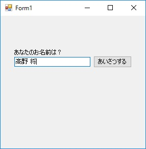
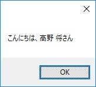
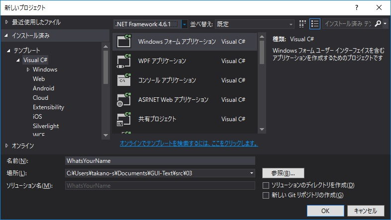
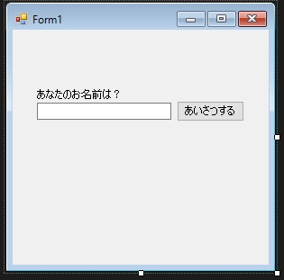
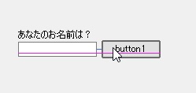
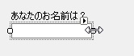

第3章 あなたのお名前は？
=====

[↑目次](..\README.md "目次")

[←第2章 ボタンを押すと……？](02-click-button.md)

第2章ではボタンを押したときに何か処理を行う方法について理解しました。今度は、ユーザーの入力内容をどのように取得して利用するのか学んでいきましょう。

## アプリ作成

この章で作成するのは、テキストボックスが一つ、ボタンが一つある簡単なアプリです（図3-1）。テキストボックスに名前を入力してボタンをクリックすると、"こんにちは、 (テキストボックスに入力した名前)さん"と書かれたメッセージボックスが表示されます（図3-2）。



図3-1 アプリ起動



図3-2 メッセージボックス表示


### コントロールの配置

それでは、2章と同様にアプリを作成していきましょう。新たなWindows Formアプリケーションプロジェクト「WhatsYourName」を作成してください（図3-3）。



図3-3 WhatsYourNameプロジェクトの新規作成

次に「ツールボックス」ウィンドウから`Label`コントロール、`TextBox`（テキストボックス）コントロール、`Button`コントロールをそれぞれフォームに配置します。そして、`Label`コントロールの`Text`プロパティに"あなたのお名前は？"を、`Button`コントロールの`Text`プロパティに"あいさつする"を設定します（図3-4）。



図3-4 フォームへコントロールの配置

なお、コントロールを配置する際、ドラッグ＆ドロップでコントロールを移動していると、「スナップ線（ライン）」というガイドが表示され、左端や中心位置を揃えることが楽にできるようになっています（図3-5）。



図3-5 スナップ線

また、コントロールを選択すると表示される小さな白四角をドラッグ＆ドロップすることで、コントロールのサイズを変更できます（図3-6）。



図3-6 コントロールのサイズ変更


### ボタンの処理を作成

次に第2章と同じようにボタンを押したときに行う処理を作成していきます。まず、フォームに配置したボタンをダブルクリックして、クリックイベントハンドラーを作成してください。そして、テキストボックスの値を使ってメッセージを表示するコードを書いてみましょう（リスト3-1）。

リスト3-1 メッセージ表示処理（`Form1.cs`より）

```csharp
private void button1_Click(object sender, EventArgs e)
{
    var name = textBox1.Text;
    MessageBox.Show($"こんにちは、{name}さん");
}
```

### 動作確認

それでは、`F5`キーを押して、実際に動かして動作を確認してみましょう。図3-1の画面が表示され、名前を入力してボタンを押すと、図3-2のようにメッセージボックスが表示されるはずです。


## 動作の仕組み

本章のコードはほぼ前章と同じですが、唯一違うのがテキストボックスに入力した値を使っていることです。その個所を抜き出してみましょう。

```csharp
var name = textBox1.Text;
```

まず、`textBox1`というのは、第1章で述べたように、フォームに張り付けたコントロールの実態であるフィールドです。テキストボックスなので、`textBox1`は`TextBox`型で宣言されています。
そして、このコードでは`textBox1`フィールドの`Text`プロパティを取得して、`name`というローカル変数に設定しています。`Text`プロパティはすべてのコントロールが共通でもつプロパティです。`TextBox`コントロールでは、テキストボックスに入力、表示されている値を、文字列（`string`）型として取得できます。
このように、Windows Forms アプリケーションでは、コントロールの「状態」を、そのフィールドのプロパティを通じて取得、設定して処理を行います。

さて、次の章では、これまで登場した以外によく使うコントロールについて、その機能と主な使い方を学んでいきましょう。

[→第4章 様々なコントロールたち](04-various-controls.md)  
