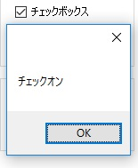
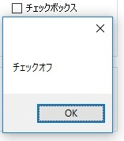

第4章 様々なコントロールたち
=====

[↑目次](..\README.md "目次")

[←第3章 あなたのお名前は？](03-whats-your-name.md)

ここまでの章では、Label（ラベル）、Button（ボタン）、TextBox（テキストボックス）コントロールを使った簡単なアプリを作成し、Windows Forms アプリケーションの基本的な作り方を学んできました。しかし、実用的なアプリケーションにはもっと様々なコントロールが必要です。本章では、主に使われるコントロールについて、その特徴と使い方を学んでいきます。

## コントロールの基本

これまで学んできたLabel（ラベル）、Button（ボタン）、TextBox（テキストボックス）コントロールなどの各種コントロール、さらにはForm（フォーム）クラスも、実はすべて同じ型の派生型です。その型とは[System.Windows.Forms.Controlクラス](https://msdn.microsoft.com/ja-jp/library/system.windows.forms.control.aspx)（以下Controlクラス）です。

Controlクラスは前章で紹介した`Text`プロパティのような基本的なプロパティ、イベント、メソッドなどのメンバーを備えています。そのため、各種のコントロールをControlクラスの変数として共通的に扱うことができるようになっています。例えば、ForeColorプロパティを使えば、画面上のすべてのコントロールの文字色を一括して変更する、といったことができます。

これらのメンバーの主なものを簡単に紹介します。詳しくは上記リンク先のMSDNライブラリを参照してください。

### プロパティ

#### 見た目に関するもの
| 名前 | 読み方 | 説明 |
| --- | --- | --- |
| BackColor | バックカラー | 背景色を指定する |
| ForeColor | フォアカラー | 前景色（文字の色）を指定する |
| Enabled | イネイブルド | コントロールが有効かどうか指定する |
| Visible | ヴィジブル | コントロールを表示するかどうか指定する |

#### 配置に関するもの
| 名前 | 読み方 | 説明 |
| --- | --- | --- |
| Location | ロケーション | コントロールの位置を指定する |
| Left | レフト | コントロールの左からの位置を指定する |
| Top | トップ | コントロールの上からの位置を指定する |
| Size | サイズ | コントロールの大きさを指定する |
| Width | ウィドゥス | コントロールの幅を指定する |
| Height | ハイト | コントロールの高さを指定する |

#### 挙動に関するもの
| 名前 | 読み方 | 説明 |
| --- | --- | --- |
| Text | テキスト | コントロールに表示する文字列を指定する |
| TabIndex | タブインデックス | Tabキーによるカーソルの移動順を指定する |

### メソッド

| 名前 | 読み方 | 説明 |
| --- | --- | --- |
| Focus | フォーカス | コントロールにカーソルを設定する |
| Show | ショウ | コントロールを表示する |
| Hide | ハイド | コントロールを隠す |

### イベント

| 名前 | 読み方 | 説明 |
| --- | --- | --- |
| Click | クリック | コントロールがクリックされたときに発生する |
| Enter | エンター | コントロールにカーソルが設定されるときに発生する |
| Leave | リーヴ | コントロールからカーソルが外れるときに発生する |
| TextChanged | テキストチェンジド | コントロールのTextプロパティが変更されたときに発生する |
| KeyDown | キーダウン | コントロール上でキーが押されたときに発生する |

## 主なコントロール

基本を押さえたところで、今度は主なコントロールについてそれぞれ学んでいきましょう。各種コントロールの特徴を知るために作成したサンプルアプリケーションが「VariousControls」です（図4-1）。以後の説明はVisual Studioで「VariousControls」プロジェクトを開き、一緒に参照しながら学習を進めてください。


図4-1 VariousControlsサンプルアプリケーション

なお、今回は次のコントロールを取り上げます。他のコントロールについては別途Web検索等で調べてください。


- コモンコントロール
    - `Label`（ラベル）
    - `Button`（ボタン）
    - `TextBox`（テキストボックス）
    - `CheckBox`（チェックボックス）
    - `RadioButton`（ラジオボタン）
    - `ListBox`（リストボックス）
    - `ComboBox`（コンボボックス）
- コンテナーコントロール
    - `Panel`（パネル）
    - `GroupBox`（グループボックス）
- データコントロール
    - `DataGridView`（データグリッドビュー）

### コモンコントロール

「ツールボックス」ウィンドウの「コモンコントロール」タブに含まれるコントロールです。基本的なユーザーとの対話で用いられるコントロール群で、最も使用機会が多いものです。

#### Label（ラベル）コントロール

テキストを表示するためのコントロールがLabel（ラベル）コントロールです（図4-2）。


図4-2 Labelコントロール

Labelコントロールはこれまでの章でも何度も登場していますが、Controlクラスより継承したTextプロパティに表示したいテキスト文字列を設定して使います。
また、前背景色を変更したいときは、同じくControlクラスより継承したForeColor、BackColorプロパティに、System.Drawing.Color構造体の値を設定します。「フォームデザイナ」で設定するときは、「プロパティ」ウィンドウの該当項目にて、「カラーパレット」から選択できます（図4-3）。


図4-3 デザイナーでの色の選択

#### Button（ボタン）コントロール

ユーザーからの何らかの処理の「実行」を引き受けるためのコントロールがButton（ボタン）コントロールです（図4-4）。


図4-4 Buttonコントロール

Buttonコントロールは第2章、第3章でも紹介した通り、Clickイベントハンドラーを記述することで、ユーザーからの何らかの処理の「実行」の引き金として使います。すでに前の章で説明した内容ですので、ここでの説明は以上とします。

#### TextBox（テキストボックス）コントロール

テキストを入力、表示するためのコントロールがTextBox（テキストボックス）コントロールです（図4-5）。


図4-5 TextBoxコントロール

TextBoxコントロールは前章でも紹介しましたが、Labelコントロールと同様に、Controlクラスより継承したTextプロパティを使うことで、入力された文字列の取得、任意の文字烈の表示を行います。

TextBoxコントロールで特徴的なプロパティの一つに、「ReadOnly（リードオンリー）」プロパティ（bool型）があります。このプロパティはその名のとおり、`true`を設定することでテキストボックスを読取専用にすることができます。読取専用になったテキストボックスは、背景色が灰色となり、入力できないことが見た目で分かるように変更されます。

また、TextBoxコントロールでよく使うイベントに「TextChanged（テキストチェンジド）」イベントがあります。このイベントは、Textプロパティの値がユーザーによる入力や、コードによる設定で変更されたとき発生します（変更前後のテキストが同じでも発生する）。このイベントを使うことで、例えば「入力文字数が5文字を超えたら警告メッセージを表示する」とったこともできます（リスト4-2、図4-6）。

リスト4-2 TextChangedイベントハンドラー（`Form1.cs`より）

```csharp
private void textBox1_TextChanged(object sender, EventArgs e)
{
    if (textBox1.Text.Length > 5)
    {
        MessageBox.Show("入力文字数が5文字を超えました");
    }
}
```


図4-6 入力文字数が5文字を超えた際のメッセージ

#### CheckBox（チェックボックス）コントロール

ユーザーにチェックオン／オフで選択させるためのコントロールがCheckBox（チェックボックス）コントロールです（図4-7）。


図4-7 CheckBoxコントロール

CheckBoxのチェックオン／オフの状態は、Checked（チェックド）プロパティ（bool型）で取得、設定します。また、チェックオン／オフの切り替えのタイミングで何か処理を行いたい場合は、CheckedChanged（チェックドチェンジド）イベントを使用します（リスト4-3、図4-8）。

リスト4-3 CheckedChangedイベントハンドラー（`Form1.cs`より）

```csharp
private void checkBox1_CheckedChanged(object sender, EventArgs e)
{
    MessageBox.Show("チェック" + (checkBox1.Checked ? "オン" : "オフ"));
}
```

 

図4-8 チェック状態を変更時に表示

