第4章 様々なコントロールたち
=====

[↑目次](..\README.md "目次")

[←第3章 あなたのお名前は？](03-whats-your-name.md)

ここまでの章では、Label（ラベル）、Button（ボタン）、TextBox（テキストボックス）コントロールを使った簡単なアプリを作成し、Windows Forms アプリケーションの基本的な作り方を学んできました。しかし、実用的なアプリケーションにはもっと様々なコントロールが必要です。本章では、主に使われるコントロールについて、その特徴と使い方を学んでいきます。

## コントロールの基本

これまで学んできたLabel（ラベル）、Button（ボタン）、TextBox（テキストボックス）コントロールなどの各種コントロール、さらにはForm（フォーム）クラスも、実はすべて同じ型の派生型です。その型とは[System.Windows.Forms.Controlクラス](https://msdn.microsoft.com/ja-jp/library/system.windows.forms.control.aspx)（以下Controlクラス）です。

Controlクラスは前章で紹介した`Text`プロパティのような基本的なプロパティ、イベント、メソッドなどのメンバーを備えています。そのため、各種のコントロールをControlクラスの変数として共通的に扱うことができるようになっています。例えば、ForeColorプロパティを使えば、画面上のすべてのコントロールの文字色を一括して変更する、といったことができます。

これらのメンバーの主なものを簡単に紹介します。詳しくは上記リンク先のMSDNライブラリを参照してください。

### プロパティ

#### 見た目に関するもの

| 名前  | 説明 |
| --- | --- |
| BackColor（バックカラー） | 背景色を指定する |
| ForeColor（フォアカラー） | 前景色（文字の色）を指定する |
| Enabled（イネイブルド） | コントロールが有効かどうか指定する |
| Visible（ビジブル） | コントロールを表示するかどうか指定する |

#### 配置に関するもの
| 名前 | 説明 |
| --- | --- |
| Location（ロケーション） | コントロールの位置を指定する |
| Left（レフト） | コントロールの左からの位置を指定する |
| Top（トップ） | コントロールの上からの位置を指定する |
| Size（サイズ） | コントロールの大きさを指定する |
| Width（ウィドゥス） | コントロールの幅を指定する |
| Height（ハイト） | コントロールの高さを指定する |

#### 挙動に関するもの
| 名前 | 説明 |
| --- | --- |
| Text（テキスト） | コントロールに表示する文字列を指定する |
| TabIndex（タブインデックス） | Tabキーによるカーソルの移動順を指定する |

### メソッド

| 名前 | 説明 |
| --- | --- |
| Focus（フォーカス） | コントロールにカーソルを設定する |
| Show（ショウ） | コントロールを表示する |
| Hide（ハイド） | コントロールを隠す |

### イベント

| 名前 | 説明 |
| --- | --- |
| Click（クリック） | コントロールがクリックされたときに発生する |
| Enter（エンター） | コントロールにカーソルが設定されるときに発生する |
| Leave（リーブ） | コントロールからカーソルが外れるときに発生する |
| TextChanged（テキストチェンジド） | コントロールのTextプロパティが変更されたときに発生する |
| KeyDown（キーダウン） | コントロール上でキーが押されたときに発生する |

## 主なコントロール

基本を押さえたところで、今度は主なコントロールについてそれぞれ学んでいきましょう。各種コントロールの特徴を知るために作成したサンプルアプリケーションが「VariousControls」です（図4-1）。以後の説明はVisual Studioで「VariousControls」プロジェクトを開き、一緒に参照しながら学習を進めてください。

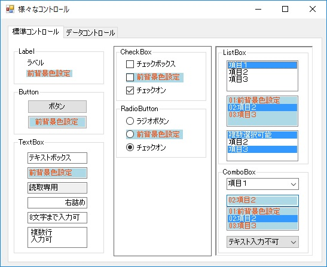

図4-1 VariousControlsサンプルアプリケーション

なお、今回は次のコントロールを取り上げます。他のコントロールについては別途Web検索等で調べてください。


- コモン コントロール
    - Label（ラベル）
    - Button（ボタン）
    - TextBox（テキストボックス）
    - CheckBox（チェックボックス）
    - RadioButton（ラジオボタン）
    - ListBox（リストボックス）
    - ComboBox（コンボボックス）
- コンテナー コントロール
    - Panel（パネル）
    - GroupBox（グループボックス）
    - TabControl（タブコントロール）
- データコントロール
    - DataGridView（データグリッドビュー）

### コモン コントロール

「ツールボックス」ウィンドウの「コモン コントロール」タブに含まれるコントロールです。基本的なユーザーとの対話で用いられるコントロール群で、最も使用機会が多いものです。

#### Label（ラベル）コントロール

テキストを表示するためのコントロールがLabel（ラベル）コントロールです（図4-2）。

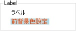

図4-2 Labelコントロール

Labelコントロールはこれまでの章でも何度も登場していますが、Controlクラスより継承したTextプロパティに表示したいテキスト文字列を設定して使います。
また、前背景色を変更したいときは、同じくControlクラスより継承したForeColor、BackColorプロパティに、System.Drawing.Color構造体の値を設定します。「フォームデザイナ」で設定するときは、「プロパティ」ウィンドウの該当項目にて、「カラーパレット」から選択できます（図4-3）。

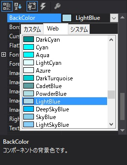

図4-3 デザイナーでの色の選択

#### Button（ボタン）コントロール

ユーザーからの何らかの処理の「実行」を引き受けるためのコントロールがButton（ボタン）コントロールです（図4-4）。

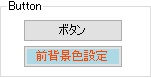

図4-4 Buttonコントロール

Buttonコントロールは第2章、第3章でも紹介した通り、Clickイベントハンドラーを記述することで、ユーザーからの何らかの処理の「実行」の引き金として使います。すでに前の章で説明した内容ですので、ここでの説明は以上とします。

#### TextBox（テキストボックス）コントロール

テキストを入力、表示するためのコントロールがTextBox（テキストボックス）コントロールです（図4-5）。

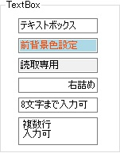

図4-5 TextBoxコントロール

TextBoxコントロールは前章でも紹介しましたが、Labelコントロールと同様に、Controlクラスより継承したTextプロパティを使うことで、入力された文字列の取得、任意の文字烈の表示を行います。

##### 読取専用

TextBoxコントロールで特徴的なプロパティの一つに、ReadOnly（リードオンリー）プロパティ（bool型）があります。このプロパティはその名のとおり、`true`を設定することでテキストボックスを読取専用にすることができます（図4-6）。読取専用になったテキストボックスは、背景色が灰色となり、入力できないことが見た目で分かるように変更されます。

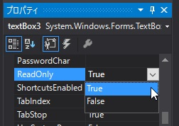

図4-6 ReadOnlyプロパティ

##### 文字の表示位置

数量や金額などの項目については、文字の表示位置を右詰めにしたいということがよくあります。そんなときはTextAlign（テキストアライン）プロパティを設定します（図4-7）。

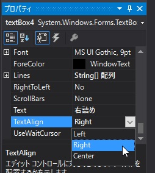

図4-7 TextAlignプロパティ

TextAlignプロパティは`System.Windows.Forms.HorizontalAlignment`列挙体で、その値は次のものが選べます。

| 値 | 説明　|
| --- | --- |
| Center | 中央詰め |
| Left | 左詰め（既定値） |
| Right | 右詰め |

##### 入力文字数制限

入力できる文字数を制限するにはMaxLength（マックスレングス）プロパティ（int型）を設定します。

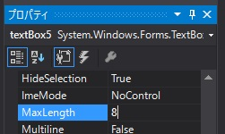

図4-8 MaxLengthプロパティ

##### 複数行入力

TextBoxコントロールに複数行のテキストを入力させるときは、MultiLine（マルチライン）プロパティ（bool型）にtrueを設定します（図4-9）。

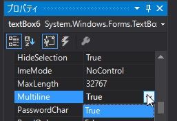

図4-9 MultiLineプロパティ

複数行入力可能にしたとき、フォームデザイナからTextプロパティに複数行のテキストを入力するには、「プロパティ ウィンドウ」でTextプロパティを選択すると表示されるボタンをクリックします。すると、入力用のテキストエリアが表示されるので、改行を含むテキストを入力後にCtrl+Enterキーで入力を確定します（図4-10）。


図4-10 フォームデザイナから複数行テキスト設定

##### テキスト変更検知

TextBoxコントロールでよく使うイベントに「TextChanged（テキストチェンジド）」イベントがあります。このイベントは、Textプロパティの値がユーザーによる入力や、コードによる設定で変更されたとき発生します（変更前後のテキストが同じでも発生する）。このイベントを使うことで、例えば「入力文字数が5文字を超えたら警告メッセージを表示する」とったこともできます（リスト4-2、図4-11）。

リスト4-2 TextChangedイベントハンドラー（`Form1.cs`より）

```csharp
private void textBox1_TextChanged(object sender, EventArgs e)
{
    if (textBox1.Text.Length > 5)
    {
        MessageBox.Show("入力文字数が5文字を超えました");
    }
}
```


図4-11 入力文字数が5文字を超えた際のメッセージ

#### CheckBox（チェックボックス）コントロール

ユーザーにチェックオン／オフで選択させるためのコントロールがCheckBox（チェックボックス）コントロールです（図4-12）。

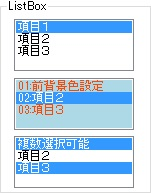

図4-12 CheckBoxコントロール

CheckBoxコントロールのチェックオン／オフの状態は、Checked（チェックド）プロパティ（bool型）で取得、設定します。また、チェックオン／オフの切り替えのタイミングで何か処理を行いたい場合は、CheckedChanged（チェックドチェンジド）イベントを使用します（リスト4-3、図4-13）。

リスト4-3 CheckBoxコントロールのCheckedChangedイベントハンドラー（`Form1.cs`より）

```csharp
private void checkBox1_CheckedChanged(object sender, EventArgs e)
{
    MessageBox.Show("チェック" + (checkBox1.Checked ? "オン" : "オフ"));
}
```

 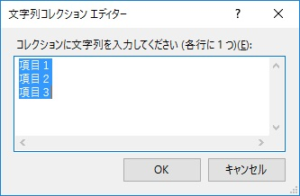

図4-13 チェック状態を変更時に表示

#### RadioButton（ラジオボタン）コントロール

ユーザーにチェックオン／オフで選択させるためのコントロールがCheckBoxコントロールの他にもう一つあります。それがRadioButton（ラジオボタン）コントロールです（図4-14）。CheckBoxコントロールはコントロール単品でチェックオン／オフを選択するのに対して、RadioButtonでは、あるきまったいくつかの選択肢から、一つをチェックして選択させることが大きな違いです。

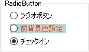

図4-14 RadioButtonコントロール

チェックオン／オフの状態はCheckBoxコントロールと同様に、Checkedプロパティで取得、設定ができます。ただし、RadioButtonコントロールは後述する「コンテナー コントロール」内に配置した複数のコントロールの内、一つだけしかチェックできないことに注意が必要です。
また、CheckedChangedイベントも、一つのRadioButtonコントロールのチェック状態を変更すると、関連する他のRadioButtonコントロールの分まで発生してしまいます。そのため、どのRadioButtonコントロールが選択されたかどうかは、それぞれのCheckedChangedイベントに共通のイベントハンドラーを登録し、イベントハンドラーの`sender`引数を使ってイベントが発生したコントロールがチェックされたかどうかを判定する必要があります（リスト4-4、図4-15、16）。

リスト4-4 RadioButtonコントロールのCheckedChangedイベントハンドラー（`Form1.cs`より）

```csharp
private void radioButton_CheckedChanged(object sender, EventArgs e)
{
    var rb = sender as RadioButton;
    if (rb.Checked)
    {
        MessageBox.Show(rb.Text);
    }
}
```

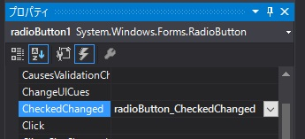 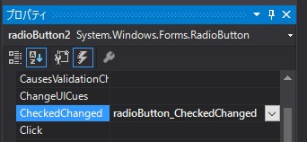 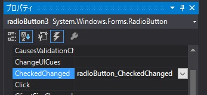

図4-15 RadioButtonのイベントハンドラー設定

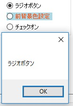  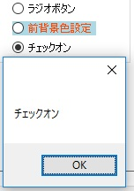

図4-16 選択したRadioButtonのラベル表示

#### ListBox（リストボックス）コントロール

いくつかの選択肢を同時に表示し、その中から任意のものを1つまたは複数選択させるためのコントロールがListBox（リストボックス）コントロールです（図4-17）。


図4-17 ListBoxコントロール

##### 選択肢の設定方法

ListBoxコントロールの選択肢は、プロパティウィンドウからItemsプロパティを選択し、表示される「…」ボタンをクリックして表示される、「文字列コレクションエディター」ダイアログを使って設定できます。このダイアログには、選択肢を改行区切りで入力します（図4-18）。

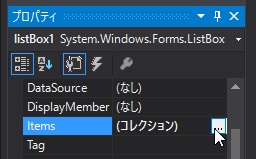 

図4-18 文字列コレクションエディターでの選択肢設定

選択肢には文字列以外のオブジェクトも設定できます。それにはコードからItemsプロパティのAddメソッドを使います（リスト4-5）。なお、Itemsプロパティは`System.Windows.Forms.ListBox.ObjectCollection`型であり、その項目はobject型のオブジェクトで管理されています。したがって、選択肢には格納されたオブジェクトのToStringメソッドの結果が表示されます。

リスト4-5 コードによる選択肢設定（`Form1.cs`より）

```csharp
class MyListItem
{
    public string Text { get; }
    public string Value { get; }

    public MyListItem(string text, string value)
    {
        Text = text;
        Value = value;
    }

    public override string ToString()
    {
        return $"{Value}:{Text}";
    }
}

private void Form1_Load(object sender, EventArgs e)
{
    listBox2.Items.Add(new MyListItem("複数選択可能", "01"));
    listBox2.Items.Add(new MyListItem("項目２", "02"));
    listBox2.Items.Add(new MyListItem("項目３", "03"));

    listBox3.Items.Add(new MyListItem("複数選択可能","01"));
    listBox3.Items.Add(new MyListItem("項目２", "02"));
    listBox3.Items.Add(new MyListItem("項目３", "03"));
}
```

##### 選択肢の「値」

選択肢項目は表示されるテキスト以外に、「値」を持つことができます。「値」を使うことで、画面に表示されたテキストに対応する「区分」、「コード」といったものをプログラムで扱いやすくなります。
「値」を持たせるためには、選択肢項目オブジェクトが持つプロパティの内、「値」として使いたいプロパティ名を、ValueMemberプロパティに設定します。同じように、表示したいプロパティ名はDisplayMemberプロパティに設定します（図4-19）。

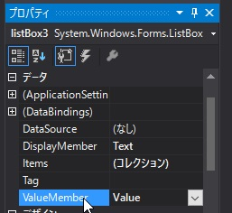

図4-19 表示用、値用プロパティ名設定

##### 選択項目の判定

ListBoxコントロールで選択した項目については、次のようなプロパティを使って設定、取得できます。

| プロパティ名 | 説明　|
| --- | --- |
| SelectedIndex（セレクテッドインデックス） | 選択項目の0オリジンのインデックス値 |
| SelectedIndices（セレクテッドインダイシズ） | 複数選択時の0オリジンのインデックス値コレクション（取得のみ） |
| SelectedItem（セレクテッドアイテム） | 選択項目オブジェクト |
| SelectedItems（セレクテッドアイテムス） | 複数選択時の選択項目オブジェクトコレクション（取得のみ） |
| SelectedValue（セレクテッドバリュー） | 選択項目の値 |

これらの内、SelectedIndicesプロパティ、SelectedItemsプロパティはforeach文を使って要素を列挙するなどして使用します。

また、選択項目が変更されたことを検知するには、次のようなイベントを使います。

| イベント名 | 説明 |
| --- | --- |
| SelectedIndexChanged（セレクテッドインデックスチェンジド） | 選択項目インデックスが変更されたときに発生 |
| SelectedValueChanged（セレクテッドバリューチェンジド） | 選択項目値が変更されたときに発生 |

例えば、選択項目値が変更されたときに選択項目をメッセージボックスで表示するというようなことができます（リスト4-6）。

リスト4-6 選択肢変更時の処理（`Form1.cs`より）

```csharp
private void listBox1_SelectedIndexChanged(object sender, EventArgs e)
{
    MessageBox.Show(Convert.ToString(listBox1.SelectedItem));
}
```

##### 複数選択可否の設定方法

ListBoxコントロールの項目を複数選択できるかどうかは、SelectionMode（セレクションモード）プロパティで設定できます（図4-20）。

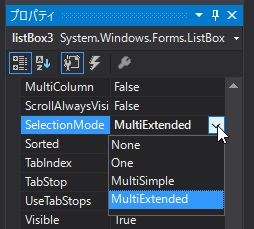

図4-20 SelectionModeプロパティ

SelectionModeプロパティは`System.Windows.Forms.SelectionMode`列挙体で、その値は次のものが選べます。

| 値 | 説明　|
| --- | --- |
| None | 選択不可 |
| One | 一つだけ選択可（既定値） |
| MultiSimple | マウスを使って複数選択可 |
| MultiExtended | マウス及びCtrlキー、Shiftキー、カーソルキーを使って複数選択可 |

#### ComboBox（コンボボックス）コントロール

ドロップダウン形式のリストボックス、もしくは直接入力で選択肢を1つ選択させるためのコントロールがComboBox（コンボボックス）コントロールです（図4-16）。選択肢の設定方法や、選択された項目の判定方法などはListBoxコントロールと同様に行えます。

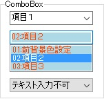

図4-21 ComboBoxコントロール

ComboBoxコントロールの項目をどのように選択させるかは、DropDownStyle（ドロップダウンスタイル）プロパティで設定できます（図4-22）。

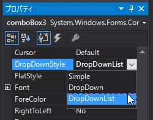

図4-22 DropDownStyleプロパティ

DropDownStyleプロパティは`System.Windows.Forms.ComboBoxStyle`列挙体で、その値は次のものが選べます。

| 値 | 説明　|
| --- | --- |
| DropDown | テキスト入力と下向三角（▼）ボタンをクリックして表示される「ドロップダウンリスト」で選択（既定値） |
| DropDownList | テキスト入力できず、ドロップダウンリストでのみ選択 |
| Simple | テキスト入力とリストボックスで選択 |

### コンテナー コントロール

「ツールボックス」ウィンドウの「コンテナー」タブに含まれるコントロールです。その名のとおり、他のコントロールを収めるためのコントロール群です。

#### Panel（パネル）コントロール

最も基本的なコンテナーで、「枠」を提供します（図4-23）。アプリケーション画面をヘッダー部、明細部のように分けたりする際によく使われます。また、枠線なしのPanelコントロールは、いくつかのRadioButtonコントロールをグループ化するためにも使われます。

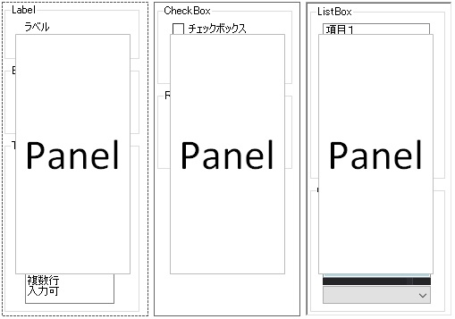

図4-23 Panelコントロール

枠線の見た目はBorderStyle（ボーダースタイル）プロパティによって変更できます（図4-24）。

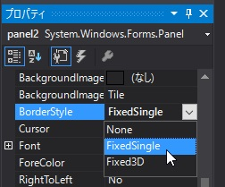


図4-24 BorderStyleプロパティ

BorderStyleプロパティは`System.Windows.Forms.BorderStyle`列挙体で、その値は次のものが選べます。

| 値 | 説明　|
| --- | --- |
| None | なし（既定値） |
| FixedSingle | 一重線 |
| Fixed3D | 3D境界線 |
