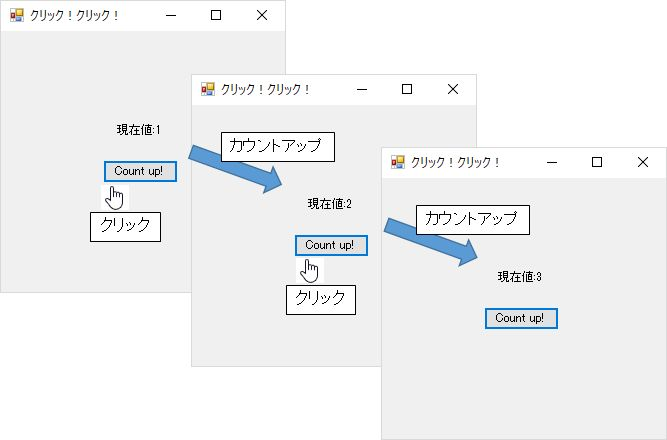
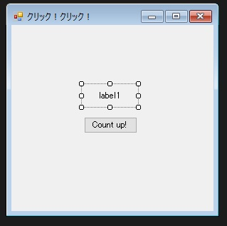

第5章 クリック！クリック！
=====

[↑目次](..\README.md "目次")

[←第4章 様々なコントロールたち](doc/04-various-controls.md)

これまでの章で各種コントロールを使った簡単なアプリケーションは作れるようになりました。この章では、そのコントロールで管理するデータ、状態をどのように管理すればよいのか学んでいきましょう。


## アプリ概要

この章で作成するのは、ボタンが一つとラベルが一つある簡単なアプリです（図5-1）。ボタンをクリックすると、ラベルに表示された数字が1からカウントアップしていきます。



図5-1 カウントアップアプリ

## コントロールのみの場合

まずは、コントロールのみでこのアプリを作ってみましょう。新しいWindows Forms アプリケーションプロジェクト「CountUp」を作成し、ラベルとボタンを配置して位置やTextプロパティを設定しましょう（図5-2）。



図5-2 コントロールの配置

次に初期値を表示するため、Form.Loadイベントハンドラーを作成します（リスト5-1）。初期値は1なので、文字列で`"1"`をラベルのTextプロパティに設定します。

リスト5-1 初期値表示（`Form1.cs`より）

```csharp
private void Form1_Load(object sender, EventArgs e)
{
    label1.Text = "1";
}
```

今度はカウントアップを行うため、Button.Clickイベントハンドラーを作成します（リスト5-2）。まずラベルの表示テキストを整数型に変換して現在値を取得します。次に現在値をカウントアップし、ラベルに設定しなおします。

リスト5-2 カウントアップ処理（`Form1.cs`より）

```csharp
private void button1_Click(object sender, EventArgs e)
{
    var currentValue = int.Parse(label1.Text);

    currentValue++;

    label1.Text = currentValue.ToString();
}
```

以上で完成です。実行して動かしてみると、ボタンを押すたびに数値がカウントアップされることが確認できます。

## コントロールのみの問題点

コントロールのみでアプリを構成しても、この程度の規模なら何も問題ないように思うかもしれません。ですが、アプリケーションには「仕様変更」が付き物です。ここで仮に、数値を`"現在値:n"`のように表示したいという要望が出たとしたらどうでしょうか？実際にコードを変更してみましょう（リスト5-3）。

リスト5-3 コントロールのみで仕様変更対応（`Form1.cs`より）

```csharp
private void Form1_Load(object sender, EventArgs e)
{
    // 変更前 | label1.Text = "1";
    label1.Text = "現在値:1";
}

private void button1_Click(object sender, EventArgs e)
{
    // 変更前 | var currentValue = int.Parse(label1.Text);
    var currentValue = int.Parse(label1.Text.Replace("現在値:", ""));

    currentValue++;

    // 変更前 | label1.Text = currentValue.ToString("");
    label1.Text = currentValue.ToString("現在値:0");
}
```

こんな小さな見た目の変更だけなのに、なんと3か所も変更しなくてはならなくなりました。まず、初期値表示の箇所で`"現在値:"`を先頭に追加します。次に、現在値取得の箇所で`"現在値:"`を取り除いて整数に変換します。最後に、現在値表示する際、`"現在値:0"`のように書式指定文字列を追加します。

また、変更箇所が多いだけではありません。`"現在値:"`という文字列があちらこちらに点在してしまっていることも問題です。この文字列を定数にして使いまわすということで、ある程度影響を抑えることはできますが、それでも文字列操作を行わなければいけないことに変わりはありません。

こんなことを、表示の仕方を変えるたびに毎回変えていては非常に手間です。また、変更箇所が多いということは、それだけ誤り、漏れの可能性が高まるということでもあります。数値をカウントアップするだけという非常に簡単なアプリでもこの調子ですから、本格的なアプリケーションではどうなるか、容易に想像がつくと思います。


