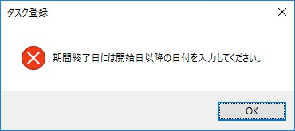
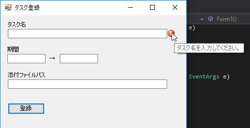
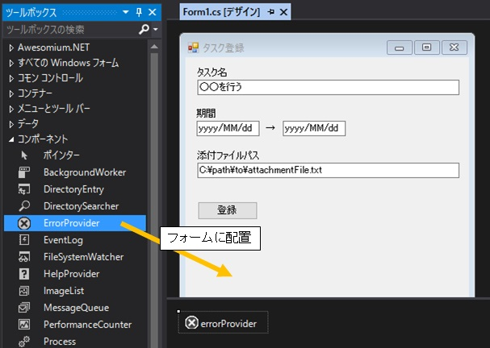

第6章 それはできません
=====

[↑目次](..\README.md "目次")

[←第5章 クリック！クリック！](05-click-click.md)

これまでの章で、アプリのデータを適切に管理し、画面に各種コントロールを使って表示できるようになりました。こんどはそのデータを画面から入力させるとき、妥当性を確保するための方法について学んでいきます。

## アプリ概要

この章で作成するのは簡単なタスク登録フォームです（図6-1）。「登録」ボタンをクリックすると、画面の各項目についてエラーチェックを行い、問題があればその内容を表示します。問題がなければ、「登録しました。」というメッセージボックスを表示します。

 

図6-1 タスク登録フォーム


## エラーの分類

実装に移る前に、エラーの分類について説明しておきます。

アプリケーションで起きるエラーは、大別すると次の2つにわけることができます。

- 業務エラー  
  アプリケーションの仕様として想定しているエラーであり、ユーザーは入力内容を変更して再度処理を実行することができます。
- システムエラー  
  アプリケーションが想定していないエラーであり、ユーザーは処理を続けることができないため、システム管理者にサポートを依頼する必要があります。

それぞれ順番に詳しく見ていきましょう。


## 業務エラー

前述のとおりアプリケーションとして想定内のことが起きたときに発生するエラーです。例えば、ユーザーの入力した内容が間違っていたり、値としては正しくてもシステムで扱えない場合などが該当します。

業務エラーが起きたら、ユーザーにその旨を通知して処理を中断します。ユーザーは通知された内容をもとに、入力内容を見直して再度処理を実行することもできますし、そこでやめることもできます。

つまり、エラーへの対応をユーザーに委ねることができるのが、業務エラーともいえます。

### 業務エラーの種類

業務エラーはそのチェック対象範囲によって、さらに次の種類に分けられます。

- 項目エラー
    - 項目単体エラー
    - 項目組合せエラー
- 突き合わせエラー

#### 項目エラー

「項目エラー」はユーザーが入力した内容だけでエラーかどうかの判断が可能なもので、さらにそれぞれの項目だけで判断する「項目単体エラー」、複数項目の関係で判断する「項目組合せチェック」に分けられます。

##### 項目単体エラーの例

- 名前が入力されていない
- 数量に数字以外が入力されている
- 商品コードの桁数が規定の長さでない

##### 項目組合せエラーの例

- 電話番号とメールアドレスのどちらも入力されていない
- 終了日に開始日より前の日付が入力されている
- メール送付チェックボックスにチェックが入っているが、メールアドレスが入力されていない

#### 突き合わせエラー

「項目エラー」とは違い、ユーザーの入力内容を元に外部の情報と「突き合わせ」て判断が必要なものは、「突き合わせエラー」と呼ばれます。ここで「外部」と呼んでいるのは「アプリケーションの外部」のことで、例えばOSの機能を使うもの（ファイルアクセスなど）も外部に含まれます。

##### 突き合わせエラーの例

- 入力された名前のファイルが存在しない
- 入力された郵便番号を外部Webサービスに問い合わせたら存在しない番号だった
- 入力した商品コードが既に使われていた


### 業務エラーの通知方法

業務エラーをユーザーに通知する方法にはいくつかあり、エラーの種類で使い分けることもよくあります。ここで、いくつか一般的な方法について紹介します。

#### メッセージボックス

メッセージを表示するという目的で一番手軽なのが、メッセージボックスを使う方法です。これまでの章でも何度か登場していますが、MessageBox.Showメソッドを呼び出すことで、メッセージボックスでメッセージを表示できます。

MessageBox.Showメソッドにはいくつもオーバーロードがあり、メッセージボックスのタイトルやアイコン、ボタンの数などを指定できます（リスト6-1、図6-2）。

リスト6-1 メッセージボックスでエラー表示（`Form1.cs`より）

```csharp
private void ShowErrorMessage(string message)
{
    MessageBox.Show(message, this.Text, MessageBoxButtons.OK, MessageBoxIcon.Error);
}
```



図6-2 メッセージボックスでエラー表示

メッセージボックスの特徴としては、ユーザーによる操作を行わないとメッセージを閉じることができないことがあります。そのため、複数の項目のエラーを順番に表示する、といった用途には向きません。

そこで、項目組合せエラーや突き合わせエラーの表示にメッセージボックスを用いることで、項目単体エラー時は他の手段で通知するとよいでしょう。

#### ErrorProvider（エラープロバイダー）コンポーネント

画面のコントロールに対してエラーメッセージを設定、表示するのが、ErrorProvider（エラープロバイダー）コンポーネントです。ErrorProviderコンポーネントのSetErrorメソッドに、エラーを設定するコントロールとエラーメッセージを引数で指定して呼び出すことで、画面のコントロールにエラーを設定できます（リスト6-2）。設定したエラーをクリアするには、SetErrorメソッドのエラーメッセージ引数に空文字を設定します。

リスト6-2 ErrorProviderコンポーネントでエラー表示（`Form1.cs`より）

```csharp
errorProvider.SetError(taskNameTextBox, "タスク名を入力してください。");
```

エラーが設定されたコントロールは、脇に「!」マークの入った赤丸アイコンが表示され、このアイコンにマウスカーソルをあてることでツールチップでエラーメッセージを確認できます（図6-3）。



図6-3 ErrorProviderコンポーネントでエラー表示

ErrorProviderコンポーネントは、ツールボックスの「コンポーネント」→「ErrorProvider」をフォームに配置して使います（図6-4）。



図6-4 ErrorProviderコンポーネントの配置

### 業務エラーの判定手順

前述のとおり、業務エラーにはいくつが種類があります。これらのエラーチェックをばらばらに行うと、どこでどのようなエラーが発生したかわかりにくくなりますし、エラー判定条件の変更への対応が難しくなってしまいます。

こういった問題を避けるため、業務エラーの判定は次のような順で行うとよいでしょう。

1. 項目チェック
    1. 項目単体チェック
    2. 項目組合せチェック
2. 突き合わせチェック

ここでもう一つのポイントとして、「項目チェック」を終えた段階でエラーがあれば、そこで中断することを勧めます。つまり、ユーザーの入力内容のみで問題がないときだけ、外部に依存する突き合わせチェックを行うのです。

こうすることで、余計な外部アクセスを抑制してパフォーマンス上にも有利になりますし、判定処理の役割も分かれて見通しがよくなります（リスト6-3）。

リスト6-3 エラー判定処理（`Form1.cs`より）

```csharp
private bool ValidateForm()
{
    CrearErrors();

    // ■項目エラーチェック

    // □項目単体チェック
    var hasItemError = false;

    // タスク名
    if (string.IsNullOrEmpty(taskNameTextBox.Text))
    {
        errorProvider.SetError(taskNameTextBox, "タスク名を入力してください。");
        hasItemError = true;
    }

    // 期間開始日
    DateTime? dueFrom;
    var dueFromIsValid = TryParseDate(dueFromTextBox.Text, out dueFrom);
    if (dueFromIsValid == false)
    {
        errorProvider.SetError(dueFromTextBox, "期間開始日に日付を入力してください。");
        hasItemError = true;
    }

    // 期間終了日
    DateTime? dueTo;
    var dueToIsValid = TryParseDate(dueToTextBox.Text, out dueTo);
    if (dueToIsValid == false)
    {
        errorProvider.SetError(dueToTextBox, "期間終了日に日付を入力してください。");
        hasItemError = true;
    }

    // □項目組合せチェック
    // 期間
    if (dueFrom.HasValue && dueTo.HasValue)
    {
        // 開始、終了日とも入力あり
        if (dueTo.Value < dueFrom.Value)
        {
            // 終了日が開始日より前
            ShowErrorMessage("期間終了日には開始日以降の日付を入力してください。");
            hasItemError = true;
        }
    }
    else
    {
        if (dueFromIsValid && dueToIsValid &&
            (dueFrom.HasValue || dueTo.HasValue))
        {
            // 開始、終了日の一方のみ入力あり
            ShowErrorMessage("期間を入力する場合、開始日と終了日の両方を入力してください。");
            hasItemError = true;
        }
    }

    if (hasItemError)
    {
        // 項目チェックエラーあり
        return false;
    }

    // ■突き合わせチェック
    if (string.IsNullOrEmpty(attachmentFilePathTextBox.Text) == false &&
        File.Exists(attachmentFilePathTextBox.Text) == false)
    {
        // 開始、終了日の一方のみ入力あり
        ShowErrorMessage($@"添付ファイル{attachmentFilePathTextBox.Text}がありません。
存在するファイルパスを入力してください。");
        return false;
    }

    return true;
}
```

このようにエラー判定処理をメソッドにしておけば、登録等の処理の見通しもよくなります（リスト6-4）。

リスト6-4 登録処理（`Form1.cs`より）

```csharp
private void registerButton_Click(object sender, EventArgs e)
{
    // エラーチェック
    var isValid = ValidateForm();

    if (isValid == false)
    {
        // 業務エラーあり
        return;
    }

    // 登録処理実行

    MessageBox.Show("タスクを登録しました。");

    ClearForm();

    SetInitialFocus();
}
```


## システムエラー

### 例外処理

システムエラーは「例外」で扱う
各画面で例外を処理せず、「集約例外ハンドラー」で一括して行う

### システムエラーの通知方法

- メッセージボックス
- 独自エラーダイアログ

### システムエラーの後処理

直ちにアプリケーションを終了する
