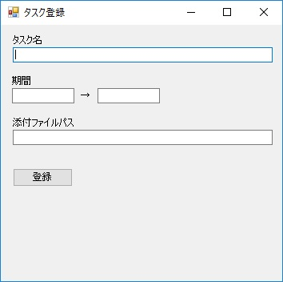
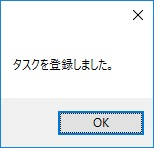

第6章 それはできません
=====

[↑目次](..\README.md "目次")

[←第5章 クリック！クリック！](05-click-click.md)

これまでの章で、アプリのデータを適切に管理し、画面に各種コントロールを使って表示できるようになりました。こんどはそのデータを画面から入力させるとき、妥当性を確保するための方法について学んでいきます。

## アプリ概要

この章で作成するのは簡単なタスク登録フォームです（図6-1）。「登録」ボタンをクリックすると、画面の各項目についてエラーチェックを行い、問題があればその内容を表示します。問題がなければ、「登録しました。」というメッセージボックスを表示します。

 

図6-1 タスク登録フォーム

## エラーの分類

実装に移る前に、エラーの分類について説明しておきます。

アプリケーションで起きるエラーは、大別すると次の2つにわけることができます。

- 業務エラー  
  アプリケーションの仕様として想定しているエラーであり、ユーザーは入力内容を変更して再度処理を実行することができます。
- システムエラー  
  アプリケーションが想定していないエラーであり、ユーザーは処理を続けることができないため、システム管理者にサポートを依頼する必要があります。

それぞれ順番に詳しく見ていきましょう。

## 業務エラー

### 業務エラーの種類
- 項目単体チェック
- 項目組合せチェック
- 突き合わせチェック

- 項目単体チェック
- 項目組合せチェック
- 突き合わせチェック

### 業務エラーの通知方法

- メッセージボックス
- ErrorProvider（エラープロバイダー）コンポーネント

## システムエラー

### 例外処理

システムエラーは「例外」で扱う
各画面で例外を処理せず、「集約例外ハンドラー」で一括して行う

### システムエラーの通知方法

- メッセージボックス
- 独自エラーダイアログ

### システムエラーの後処理

直ちにアプリケーションを終了する
