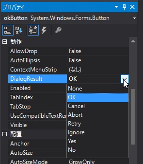

第7章 貴方にお任せ
=====

[↑目次](..\README.md "目次")

[←第6章 それはできません](06-cannot-do-it.md)

ここまでの章の内容を使えば、単一画面しかないアプリケーションであれば、十分なものができるようになります。ただ、実際のアプリケーションでは、複数の画面を使った処理ができないと困ったことになります。

そこで、本章と次の章では、複数画面を使った連携処理について学んできます。

## 子画面の呼び出し方

自らの画面（親画面）から他の画面（子画面）を呼び出して表示するには、次の2つの方法があります。

- モーダル表示  
  子画面を表示した際、親画面の操作をブロックして完全に子画面に処理を移譲する方法
- モードレス表示  
  子画面を表示しても親画面も引き続き操作可能にする方法

本章では「モーダル表示」のやり方について学んでいきます。

## アプリ概要

本章で扱うサンプルアプリは2つの画面で構成されています。

一つはメイン画面で、商品コードの入力と商品名の表示、そして商品検索子画面を呼び出すための「商品検索」ボタンがあります（図7-1）。


図7-1 メイン画面

「商品検索」ボタンをクリックすると、メイン画面の商品コードに入力した値を、検索条件として商品検索画面に受け渡してモーダル表示します。このとき、受け渡した商品コードは初期値として絞り込み条件の商品コード欄に表示され、その値を含む商品だけに絞り込んで、商品検索画面は表示されます（図7-2）。

 

図7-2 商品検索画面

商品検索画面では、絞り込み条件の商品コードを変更して、「絞り込み」ボタンをクリックすると、入力した値で再度商品の絞り込みを行えます。

そうして目的の商品があったら、グリッドで選択して「OK」ボタンをクリックすることで、商品の選択が行えます。「OK」ボタンをクリックすると、商品検索画面は閉じられ、親画面の商品コード、商品名に選択した商品の情報が表示されます（図7-3）。

 

図7-3 商品選択後

仮に商品検索画面で「キャンセル」ボタンがクリックされた場合、商品選択は行われず、メイン画面の表示も変更されません。

## モーダル表示

子画面をモーダル表示するには、対象となる画面のフォームクラスのインスタンスを作成し、そのShowDialog（ショウダイアログ）メソッドを呼び出します（リスト7-1）。このとき、フォームクラスはIDisposableインターフェースを実装しているので、using構文を使って必ずDisposeメソッドが呼ばれるようにしてください。

リスト7-1 モーダル表示（`MainForm.cs`の商品検索ボタンクリックハンドラーより）

```csharp
using (var searchProductDialog = new SearchProductDialog(productCode: productCodeTextBox.Text))
{
    ...（略）...
}
```

### 子画面への情報受け渡し

リスト7-1を見ると分かるのですが、親画面から子画面に情報を渡したいときは、子画面のコンストラクターで必要な情報を受け渡すのが一般的です。子画面側ではコンストラクターで必要な情報を受け取った後、Loadイベントハンドラーでその情報を使って処理を行います（リスト7-2）。サンプルでは親画面から受け取った商品コードを画面に設定し、絞り込み処理を実行しています。

リスト7-2 親画面からの情報受け取り（`SearchProductDialog.cs`より）

```csharp
private readonly string productCode;

public SearchProductDialog(string productCode) : this()
{
    this.productCode = productCode;
}

private void SearchProductForm_Load(object sender, EventArgs e)
{
    productCodeTextBox.Text = productCode;

    FilterProducts(productCodeTextBox.Text);
}
```

あくまでコンストラクターはインスタンスを作る役割に徹して、実際の処理はイベントハンドラーに任せることで、処理の複雑化を防ぐことができます。

### 子画面の処理結果の判定

子画面での処理結果を判定するには、子画面のフォームクラスのDialogResultプロパティを使います。このプロパティの型はSystem.Windows.Forms.DialogResult構造体で、OKやキャンセルといった処理結果を表します。

このDialogResultプロパティをモーダル表示された画面の結果を子画面側で設定すると、呼び出し元である親画面ではShowDialogメソッドの戻り値として参照することができます（リスト7-3）。これを利用して、OKの時だけ処理を行う、といったことが実現できます。

リスト7-3 DialogResult参照（`MainForm.cs`の商品検索ボタンクリックハンドラーより）

```csharp
var result = searchProductDialog.ShowDialog();
if (result == DialogResult.OK)
{
    ...（略）...
}
```

DialogResultプロパティの設定方法は、ボタンクリックイベントハンドラーなどでコードから直接設定する方法の他、ButtonコントロールのDialogResultプロパティにデザイナーから設定しておけば、そのButtonコントロールをクリックすると自動的にフォームのDialogResultプロパティに設定されます（図7-4）。



図7-4 ボタンへのDialogResult設定

### 子画面の情報の取得

子画面の処理がOKなら、子画面から情報を得たいケースがよくあります。例えば、今回のサンプルのように、子画面で検索した後、選択したデータの情報を親画面に表示する、といったものです。

子画面から必要な情報を得るには、子画面の読取専用プロパティを用います（リスト7-4）。

リスト7-4 子画面の情報公開（`SearchProductDialog.cs`より）

```csharp
public Product SelectedProduct { get; private set; }

private void okButton_Click(object sender, EventArgs e)
{
    var selectedProductCode = productDataGridView.CurrentRow?.Cells?[0]?.Value as string;

    if (string.IsNullOrEmpty(selectedProductCode))
    {
        return;
    }

    SelectedProduct = products.First(product => product.Code == selectedProductCode);
}
```

サンプルでは、OKボタンをクリックした際、グリッドで選択した商品情報を探し、読取専用プロパティSelectedProductに設定しています。

呼び出し側では、子画面を開いた時のusingブロック内で（つまりはDisposeメソッドが呼ばれる前に）このプロパティにアクセスします（リスト7-5）。

リスト7-5 子画面から情報取得（`MainForm.cs`の商品検索ボタンクリックハンドラーより）

```csharp
var selectedProduct = searchProductDialog.SelectedProduct;

productCodeTextBox.Text = selectedProduct.Code;
productNameTextBox.Text = selectedProduct.Name;
```

サンプルでは選択した商品情報から、コードと名前をメイン画面に表示しています。

## 親画面と子画面の関係

モーダル表示のケースについて、親画面と子画面のやり取りについて学んできました。

こういった複数画面を連携させるアプリケーションを作る際、ついやってしまうことがあります。それは、各画面のコントロールを別の画面から直接操作するというものです（リスト7-6）。しかし、これは絶対に避けてください。

リスト7-6 コントロールの直接操作禁止

```csharp
// やってはいけないこと
searchProductDialog.productCodeTextBox.Text = this.productCodeTextBox.Text;
```

フォームクラスというのは、その画面単体でなすべき役割を果たすようにしなければなりません。このルールを破ると、どこでどのように操作されているか把握するのが非常に大変になってしまい、保守するのが困難なアプリケーションを生み出してしまいます。

また、親子関係のある画面間のやり取りでは、子画面から親画面のメンバーにアクセスするのも避けねばなりません（リスト7-7）。

リスト7-7 子から親へのアクセス禁止

```csharp
// 子画面でやってはいけないこと
(this.Parent as MainForm).SelectedProduct = products.First(product => product.Code == selectedProductCode);
```

「親は子を知っているが、子は親を知らない」という状態を死守しましょう。これを守らないと「循環参照」という相互に参照しあっている状況を生み出し、やはりどこで何が使われているかわからない、いわゆる「スパゲッティーコード」の温床となってしまいます。

あくまで参照は一方向に限定し、コンストラクター、読取専用プロパティを使って必要最小限の情報のやり取りを行うように心がけてください（図7-5）。


図7-5 親子画面の参照関係

子画面のモーダル表示のやり方と、注意すべきことについて学びました。次の章ではモードレス表示の場合について学びます。

[→ 第8章 一緒にやろう](08-work-together.md)  

