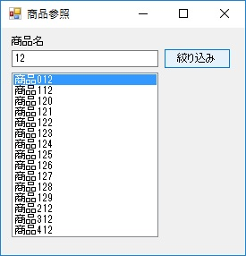
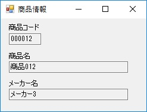

第8章 一緒にやろう
=====

[↑目次](..\README.md "目次")

[← 第7章 貴方にお任せ](07-leave-it-to-you.md)

前の章ではモーダル表示による複数画面連携の方法について学びました。本章では、モードレス表示による複数画面連携の手順について学んでいきましょう。

## アプリ概要

本章で扱うサンプルアプリは2つの画面で構成されています。

一つはメイン画面で、リストボックスに商品情報を表示してあり、商品名による絞り込みを行えます（図8-1）。

図8-1 メイン画面

もう一つは商品情報表示画面で、アプリケーション起動時にメイン画面と一緒に表示されます。この画面にはメイン画面のリストボックスで選択した商品の商品コード、商品名、メーカー名を表示します（図8-2）。また、メイン画面で商品を選択しなおすたびに、商品情報は再表示されます。

図8-2 商品情報表示画面

メイン画面を閉じると、商品情報画面も閉じてアプリケーションが終了します。

## モードレス表示

Showメソッド
親画面にインスタンスを保持する必要あり
親画面を閉じたら一緒に閉じる

## 子画面への受け渡し

設定専用プロパティ

